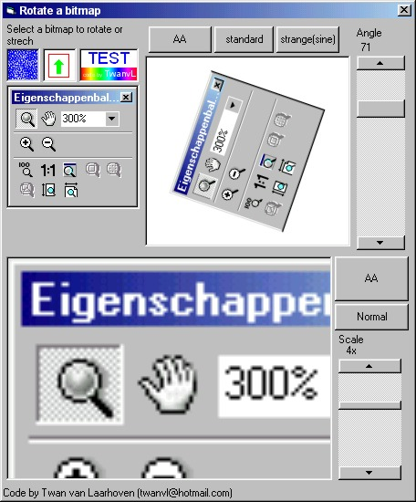



## Rotate & strech with anti\-aliasing\!

### Description

This code interpolates between pixels to create a true anti-alias effect.

With the same quality as rotated/streched pictures from profesional graphics programs!
 
### More Info
 
a bitmap, a angle/scale

For understanding the code some mathematical knowledge is required!

a rotated/streched bitmap

             |
---                |---
**Submitted On**   |2000-08-31 13:37:08
**By**             |[N/A](https://github.com/Planet-Source-Code/PSCIndex/blob/master/ByAuthor/empty.md)
**Level**          |Advanced
**User Rating**    |5.0 (80 globes from 16 users)
**Compatibility**  |VB 5\.0, VB 6\.0
**Category**       |[Graphics](https://github.com/Planet-Source-Code/PSCIndex/blob/master/ByCategory/graphics__1-46.md)
**World**          |[Visual Basic](https://github.com/Planet-Source-Code/PSCIndex/blob/master/ByWorld/visual-basic.md)
**Archive File**   |[CODE\_UPLOAD94678312000\.zip](https://github.com/Planet-Source-Code/rotate-strech-with-anti-aliasing__1-11131/archive/master.zip)

